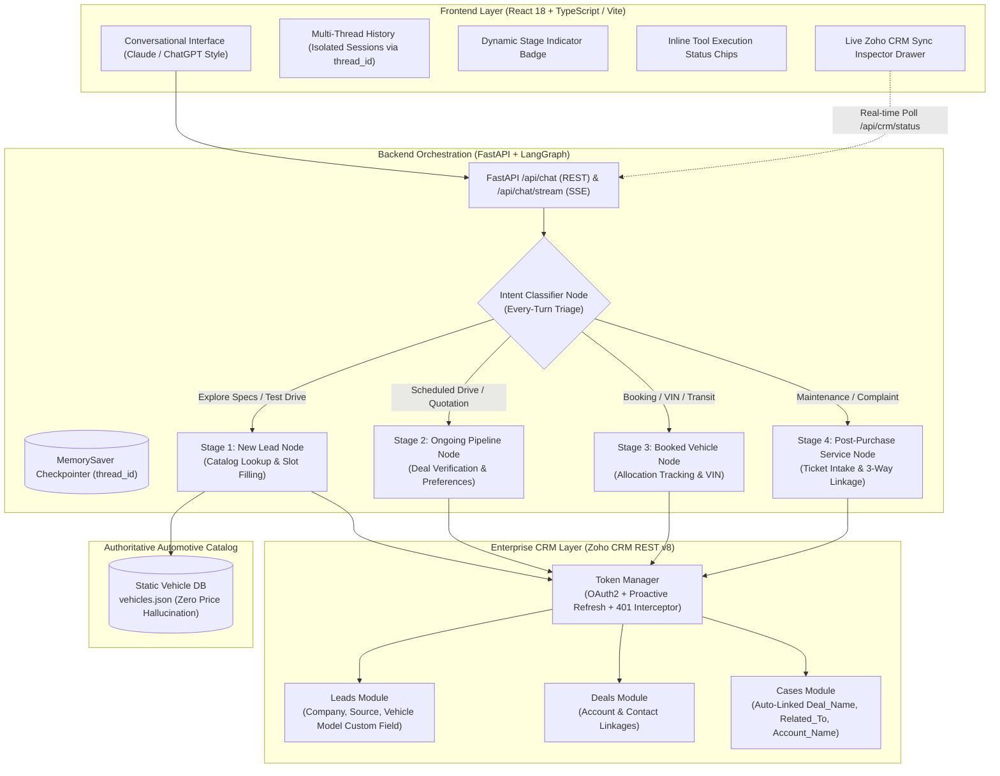

# Mahindra Automotive OEM — Multistage Conversational AI Concierge

> **Production-grade, multistage conversational AI concierge built for enterprise automotive OEMs (like Mahindra & Mahindra). Features dynamic every-turn intent triage across the 4 key stages of the customer lifecycle, an authoritative catalog for zero price/specification hallucination, and real-time bidirectional synchronization with Zoho CRM REST API v8.**

---

## Repository Structure & Separation of Concerns

The repository is cleanly architected with strict separation between the backend service and the frontend interface:

```text
OEM Agent/
├── Dockerfile                  # Multi-stage production container for Hugging Face Spaces (Port 7860)
├── docker-compose.yml          # One-command orchestration for prebuilt Docker Hub images
├── push_to_dockerhub.sh        # Automated image build & push script for Docker Hub (wh0mm1)
├── .env.example                # Unified environment configuration template
├── .gitignore                  # Comprehensive ignore rules for Python, Node, OS & Secrets
├── README.md                   # Complete architectural documentation & execution guide
├── backend/                    # Core Python / LangGraph / FastAPI Backend Service
│   ├── agent/                  # LangGraph StateGraph, Intent Triage, Prompts & Tools
│   ├── api/                    # FastAPI REST (/api/chat) & SSE Streaming (/api/chat/stream)
│   ├── core/                   # Pydantic Schemas, App Config & State TypedDict
│   ├── data/                   # Authoritative Vehicle Catalog (vehicles.json & vehicle_db.py)
│   ├── zoho/                   # OAuth 2.0 Token Manager, REST v8 Client & Mock CRM
│   ├── tests/                  # Automated Pytest Suite (6/6 passing)
│   ├── static/                 # Embedded fallback Web UI
│   ├── seed_zoho.py            # Live Zoho CRM database seeder (Rajesh, Priya, Anand)
│   ├── clean_crm.py            # Targeted test record cleanup script
│   ├── Dockerfile              # Backend container definition (Python 3.11 + uv)
│   ├── pyproject.toml          # uv package dependencies
│   ├── uv.lock                 # Deterministic dependency lockfile
│   ├── langgraph.json          # LangGraph Studio dev inspection configuration
│   └── main.py                 # Application launcher
└── frontend/                   # Modern React 18 + TypeScript + Vite + Tailwind UI
    ├── src/
    │   ├── components/
    │   │   ├── Sidebar.tsx     # Claude/ChatGPT style thread history sidebar
    │   │   ├── ChatMessageView.tsx # Markdown renderer + inline tool status chips
    │   │   ├── EmptyState.tsx  # Suggestion prompt cards for all 4 lifecycle stages
    │   │   └── CrmDrawer.tsx   # Slide-out live Zoho CRM database inspector
    │   ├── App.tsx             # Multi-thread orchestrator & active stage header
    │   ├── types.ts            # TypeScript interfaces (ChatThread, Message, ToolChip)
    │   ├── index.css           # Custom scrollbars & Markdown table styling
    │   └── main.tsx            # React application entry point
    ├── Dockerfile              # Frontend container definition (Node 20 Alpine)
    ├── vite.config.ts          # Vite configuration with automatic backend proxy
    ├── tailwind.config.js      # Automotive midnight navy theme
    └── package.json            # React, Lucide, Tailwind, React-Markdown dependencies
```

---

## System Architecture



---

## 1. Customer Lifecycle Matrix & Business Logic

| Lifecycle Stage | Customer Context & Trigger | Expected AI Agent Logic & Response | Zoho CRM Module & Schema Mapping |
| :--- | :--- | :--- | :--- |
| **1. New Lead** | Unidentified visitor asking about vehicle models (XUV700, Thar, Scorpio-N, Bolero Neo), variant pricing, or features. | Fetches authoritative specs from `vehicles.json`, pitches a test drive, and collects **Full Name**, **10-digit Phone**, **Email**, and **City**. | **`Leads`** Module:<br>• `Full_Name` (split into `First_Name`, `Last_Name`)<br>• `Company`: `"Retail Customer"` (auto-fallback)<br>• `Lead_Source`: `"Mahindra AI Digital Showroom"`<br>• `Lead_Status`: `"New"`<br>• `Vehicle_Model_of_Interest`: Custom model string |
| **2. Ongoing Pipeline** | Existing prospect providing phone number or deal ID to check test drive confirmation, quotation, or dealership contact. | Resolves active deal by phone/ID, verifies quotation amount (₹23.99L) and Worli dealership appointment, and updates follow-up preferences. | **`Deals`** Module:<br>• `Stage`: `"Proposal/Price Quote"`<br>• `Account_Name`: Linked to customer Account<br>• `Contact_Name`: Linked to customer Contact<br>• `Description`: Appends updated channel preference (e.g. WhatsApp on weekends) |
| **3. Booked Vehicle** | Customer who paid booking deposit asking for delivery timeline, VIN allocation, or balance due. | Validates Booking ID (`#MAH-9921`) or phone, retrieves allocation stage (*In Transit from Chakan Plant*), chassis VIN, and delivery date. | **`Deals`** Module (`Closed Won - Booking Done`):<br>• `Stage`: `"Closed Won"`<br>• `VIN`: `MA1TA2SK5R8109921`<br>• `Amount`: ₹24,54,000 (Balance: ₹18,50,000)<br>• `Delivery_Dealership`: Andheri West Center |
| **4. Post-Purchase / Service** | Existing owner logging a complaint, asking about service intervals, or booking a maintenance slot. | Gathers vehicle registration (`MH02CD1234`), odometer reading (`15000 km`), issue type, and service center. Dynamically sets priority and status. | **`Cases`** Module (3-Way Relational Interlinkage):<br>• **`Deal_Name`**: Linked to Deal ID (`Deals` lookup)<br>• **`Related_To`**: Linked to Contact ID (`Contacts` lookup)<br>• **`Account_Name`**: Linked to Account ID (`Accounts` lookup)<br>• `Status`: `"Service Appointment Scheduled"` / `"Escalated"`<br>• `Priority`: `"Low"` (periodic) / `"High"` (brake/safety) |

---

## 2. Core Architectural & Engineering Highlights

### A. Every-Turn Intent Triage & Dynamic Stage Jumping
Rather than locking the user into a rigid state machine, the classifier node runs on **every single user turn**. A user inquiring about an XUV700 AX7L test drive can abruptly pivot: *"Actually, my existing Thar has a brake shudder on the highway"* $\rightarrow$ the classifier immediately transitions state to `post_purchase_service`, carries forward the customer's phone number, infers `Priority: "High"`, and reserves a service bay without losing context.

### B. Decoupled Vehicle Catalog (Zero Price Hallucination)
Automotive ex-showroom prices and variant matrices are decoupled from the LLM's parametric weights and stored in an authoritative catalog (`backend/data/vehicles.json`). The agent executes strict lookup routines via `backend/data/vehicle_db.py`, ensuring exact ex-showroom pricing, transmission variants, and Level-2 ADAS feature descriptions are communicated accurately.

### C. Proactive OAuth 2.0 Token Lifecycle & 401 Interception
In `backend/zoho/token_manager.py`:
- **Proactive Expiry Management:** Access tokens (60-minute validity) are tracked with an in-memory expiry window; fresh tokens are proactively fetched **5 minutes prior to expiration** to eliminate mid-request failures.
- **401 Interceptor & Silent Retry:** If an unexpected token revocation occurs, the client intercepts the HTTP 401, forces an immediate token refresh, and retries the failed request once before raising an error.
- **Multi-Data Center Support:** Automatically configures accounts and API base URLs based on `ZOHO_DC` (`.in`, `.com`, `.eu`, `.com.au`).

### D. Atomic 3-Way Relational Interlinking in Zoho CRM Cases
In Zoho CRM's REST v8 API for the `Cases` module:
- The Deal lookup field is named **`Deal_Name`** (pointing to `Deals`).
- The Contact lookup field is named **`Related_To`** (pointing to `Contacts`).
- The Account lookup field is named **`Account_Name`** (pointing to `Accounts`).

The backend automatically searches customer records by phone, resolves all three entity IDs, and creates the case with all three relational foreign keys populated atomically.

### E. Multi-Thread State Isolation (Claude / ChatGPT Style)
Each conversation in the React interface generates a dedicated `thread_id` mapped directly to LangGraph's `MemorySaver` checkpointer. Conversation histories, slot collections, and CRM IDs are strictly isolated per thread and mirrored to browser `localStorage`, preventing state pollution across customer sessions.

---

## 3. Pre-Populated Benchmark CRM Records

To enable immediate testing and offline demoing without external hurdles, the system supports both live Zoho CRM synchronization and a high-fidelity in-memory mock (`USE_MOCK_ZOHO=true`):

| Customer Name | Lifecycle Stage | Primary Identifier | Model & Details | Expected CRM Verification |
| :--- | :--- | :--- | :--- | :--- |
| **Rajesh Sharma** | Stage 1: New Lead | Phone: `9820011223` | Thar AX Opt / 4x4, Mumbai | Appears in `Leads` module with `Company: "Retail Customer"` and `Lead_Source: "Mahindra AI Digital Showroom"`. |
| **Priya Patel** | Stage 2: Ongoing Pipeline | Phone: `9819988776` | XUV700 AX7 Luxury, ₹23,99,000 | Appears in `Deals` with `Stage: "Proposal/Price Quote"`, linked to Account `Priya Patel` and Contact `Priya Patel`. Follow-up updates append to `Description`. |
| **Anand Rathi** | Stage 3: Booked Vehicle | Booking: `#MAH-9921`<br>Phone: `9822334455` | Scorpio-N Z8L 4XPLOR Diesel AT, VIN `MA1TA2SK5R8109921` | Appears in `Deals` with `Stage: "Closed Won"`, showing Chakan factory transit status and delivery date of Oct 8, 2026. |

---

## 4. Quick Start: Running with Docker Compose (Recommended)

### Option A: Instant Launch using Pre-Built Docker Hub Images (Zero-Build)

Both the Backend and Frontend images are published to Docker Hub under the **`wh0mm1`** namespace:
- **Backend Image:** [`wh0mm1/mahindra-oem-backend:latest`](https://hub.docker.com/r/wh0mm1/mahindra-oem-backend)
- **Frontend Image:** [`wh0mm1/mahindra-oem-frontend:latest`](https://hub.docker.com/r/wh0mm1/mahindra-oem-frontend)

Anyone can immediately spin up the complete concierge stack without compiling source code or installing Python / Node.js locally:

```bash
# 1. Clone the repository and configure the unified environment
cp .env.example .env

# 2. Launch the pre-built containers (automatically pulls wh0mm1 images from Docker Hub)
docker compose up
```

- **React Frontend (Claude / ChatGPT Style):** Open **`http://localhost:3000`**
- **FastAPI Backend & Interactive API Docs:** Open **`http://localhost:8000/docs`**

To stop the containers:
```bash
docker compose down
```

---

### Option B: Local Container Build & Development

If you are modifying the codebase or wish to build the container images locally from source:

```bash
# 1. Configure the environment
cp .env.example .env

# 2. Build and start containers locally
docker compose up --build
```

To build and push fresh image releases to Docker Hub under `wh0mm1`:
```bash
# Ensure you are logged into Docker Hub (docker login -u wh0mm1)
./push_to_dockerhub.sh
```

---

## 5. Free Cloud Deployment: Hugging Face Spaces (Always-On, 16 GB RAM)

Hugging Face Spaces provides a **100% free, always-on (no sleep)** Docker runtime with **2 vCPUs and 16 GB RAM**. The root `Dockerfile` packages both the compiled React frontend and FastAPI backend into a single unified container listening on port `7860`.

### Step-by-Step Deployment Guide:

1. **Create a Space on Hugging Face:**
   * Navigate to [huggingface.co/new-space](https://huggingface.co/new-space).
   * **Space Name:** `mahindra-oem-concierge` (or your choice).
   * **License:** `apache-2.0` or `mit`.
   * **Select Space SDK:** Choose **Docker** $\rightarrow$ **Blank**.
   * **Space Hardware:** Select **Free (2 vCPU · 16 GB RAM)**.
   * **Visibility:** Public.

2. **Configure Space Secrets (Environment Variables):**
   * In your Space, navigate to **Settings** $\rightarrow$ **Variables and secrets** $\rightarrow$ **New secret**.
   * Add your secrets (all CRM authentication happens securely inside the backend, keeping your credentials hidden from visitors):
     * `OPENROUTER_API_KEY`: Your OpenRouter API key.
     * `OPENROUTER_MODEL`: `nvidia/nemotron-3-ultra-550b-a55b:free`
     * `USE_MOCK_ZOHO`: `false` (or `true` to use simulated mock CRM)
     * `ZOHO_CLIENT_ID`: Your Zoho Client ID
     * `ZOHO_CLIENT_SECRET`: Your Zoho Client Secret
     * `ZOHO_REFRESH_TOKEN`: Your Zoho Refresh Token
     * `ZOHO_DC`: `in` (or your regional DC: `com`, `eu`, etc.)

3. **Deploy via Git:**
   Run the following commands from your local repository:
   ```bash
   # Add Hugging Face Space as a git remote
   git remote add space https://huggingface.co/spaces/<your-hf-username>/mahindra-oem-concierge

   # Push code to trigger automatic build and deployment
   git push --force space main
   ```

Hugging Face Spaces will automatically build the multi-stage `Dockerfile`, start the service on port `7860`, and provide a public URL (e.g., `https://<your-hf-username>-mahindra-oem-concierge.hf.space`).

---

## 6. Usage Quota & Bring-Your-Own-Key (BYOK) Architecture

To safeguard API limits during public demos without requiring registration, the concierge incorporates an automated **Sliding-Window Hourly Rate Limiter** and **BYOK (Bring Your Own Key)** interface:

* **Hourly Shared Quota:** Automatically caps unauthenticated requests to **30 requests per hour** against the default server OpenRouter key.
* **Real-time Quota Monitoring:** The `/api/rate-limit/status` endpoint and header badge monitor active usage (e.g., `5 / 30 requests this hour`).
* **Automated BYOK Dialog:** If the 30 requests/hour limit is reached, the backend flags `requires_custom_key: true`, and the React UI automatically presents the **OpenRouter Settings Dialog**.
* **Zero Storage Leakage:** User-provided keys are stored exclusively in their own browser (`localStorage`) and sent securely per request, bypassing the server rate limit entirely.
* **Header Trigger:** Users can click the **API Key / Quota** button in the top navigation bar at any point to view remaining requests or input their custom key.

---

## 7. Local Development Setup (Without Docker)

### Prerequisites
- Python 3.11+ with [`uv`](https://docs.astral.sh/uv/) installed.
- Node.js 18+ with `npm` installed.

### Step 1: Start Backend Service
```bash
cd backend

# Synchronize python virtual environment using uv
uv sync

# (Optional) Seed live Zoho CRM portal with required test records
uv run python seed_zoho.py

# Launch FastAPI server on port 8000
uv run python main.py
```

### Step 2: Start React Frontend
In a new terminal:
```bash
cd frontend

# Install node dependencies
npm install

# Start Vite dev server on port 3000
npm run dev
```

Open **`http://localhost:3000`** in your browser. All API requests automatically proxy to the FastAPI backend.

### Step 3: Run Automated Pytest Suite
```bash
cd backend
uv run pytest -v
```

**Expected Output:**
```text
tests/test_agent.py::test_vehicle_database_zero_hallucination PASSED     [ 16%]
tests/test_agent.py::test_slot_extraction_regex PASSED                   [ 33%]
tests/test_agent.py::test_crm_mock_preseeded_records PASSED              [ 50%]
tests/test_agent.py::test_stage_idempotency_and_creation PASSED          [ 66%]
tests/test_agent.py::test_log_service_ticket_with_literals PASSED        [ 83%]
tests/test_agent.py::test_service_case_auto_links_deal_and_contact PASSED [100%]

============================== 6 passed in 0.15s ===============================
```

> *Note: Tests execute deterministically against the in-memory mock CRM in ~0.15s via the `force_mock_crm` fixture, ensuring zero network latency, no external API quota consumption, and full offline CI/CD reliability.*

### Step 4: (Optional) Inspect with LangGraph Studio
A `langgraph.json` configuration file is included inside `backend/`:
```bash
cd backend
uv run langgraph dev
```

---

## 6. API Specification

| Endpoint | Method | Payload / Params | Description |
| :--- | :--- | :--- | :--- |
| **`/api/chat`** | `POST` | `{"message": str, "thread_id": str, "session_id": str}` | Primary conversational endpoint. Executes LangGraph orchestrator and returns active stage, assistant response, inline tool chips, and collected slots. |
| **`/api/chat/stream`** | `POST` | `{"message": str, "thread_id": str, "session_id": str}` | Server-Sent Events (SSE) streaming endpoint for low perceived conversational latency. |
| **`/api/crm/status`** | `GET` | *None* | Retrieves live or mock database status for the frontend slide-out CRM Inspector Drawer. |
| **`/api/session/reset`** | `POST` | *None* | Resets in-memory conversation state. |

---

## 7. Zoho CRM Developer Console Setup Guide

To connect the agent to a free Zoho CRM developer account:

1. **Sign Up:** Create a free account at [zoho.com/crm](https://www.zoho.com/crm/).
2. **Open API Console:** Go to [api-console.zoho.com](https://api-console.zoho.com/).
3. **Create Self Client:** Click **Add Client** $\rightarrow$ select **Self Client**. Copy your `Client ID` and `Client Secret`.
4. **Generate Code:** In the **Generate Code** tab:
   - **Scope:** `ZohoCRM.modules.ALL,ZohoCRM.settings.ALL`
   - **Time Duration:** 10 minutes
   - **Scope Description:** `Mahindra AI Agent`
5. **Exchange for Refresh Token:** Run a `curl` POST request (replace with your data center domain, e.g., `.in` or `.com`):
   ```bash
   curl -X POST https://accounts.zoho.in/oauth/v2/token \
     -d "grant_type=authorization_code" \
     -d "client_id=YOUR_CLIENT_ID" \
     -d "client_secret=YOUR_CLIENT_SECRET" \
     -d "code=YOUR_GENERATED_CODE"
   ```
6. **Populate `backend/.env`:** Paste `refresh_token`, `client_id`, `client_secret`, and `ZOHO_DC` into your `backend/.env` file and set `USE_MOCK_ZOHO=false`.
